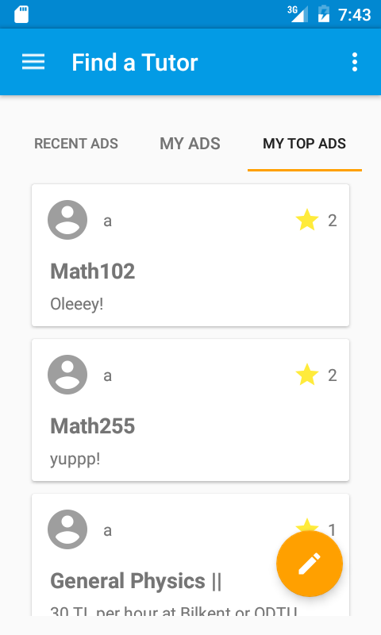
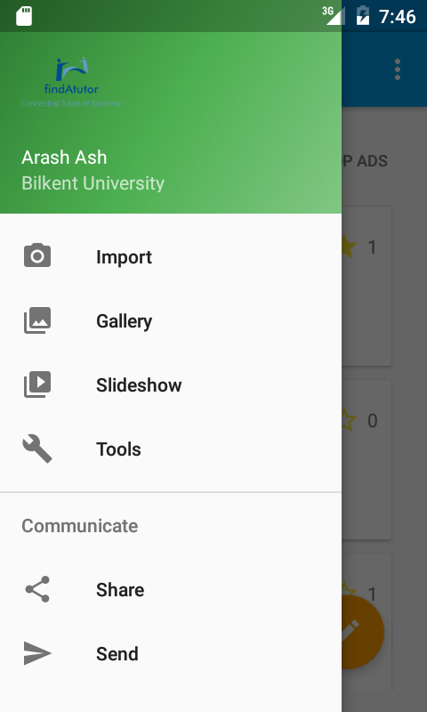
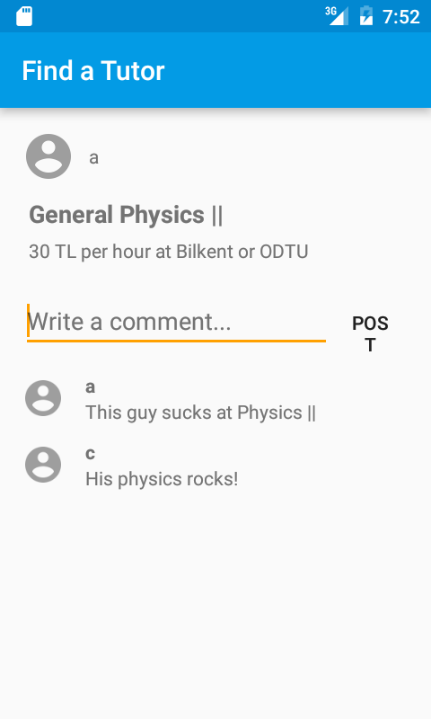

Find A Tutor
=============================

Introduction
------------

- This project is about designing and implementing and Android application that solves the challenge of connecting students and tutors together. The idea is that tutors can post “ads” for a particular course and students can request a “session” after checking the price, ratings, reviews, the course topics, schedule and the location of the tutor. However, only after tutors accept the request, students can contact the tutors in the chat session created. Also students can post “ads” for needing private lessons for a particular subject and then tutors can request for a “session”. In both cases however, the tutor will be terminating the sessions after the lesson is finished and then a notification will be sent to the student to rate the tutor.

Getting Started
---------------
wait till version 1.0!

Screenshots
-----------

